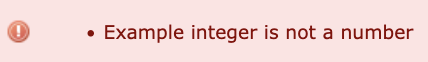

# Locale Integer Format

## Overview

Redmine plugin. Enables input and display of integer custom fields with decimal separator set in locale.

## Introduction

[Redmine](http://www.redmine.org) with its functionality offers almost everything you need, we just had to extend the functionality for our internal needs, and this plugin was the result.

## Features

Enables input and display of custom integer fields with decimal seperator set in locale.

- number.format.separator

#### Without plugin:

#### With plugin:

## Installation

To install the plugin, either clone it or download it and xtract the directory into ur plugins directory in your redmine dir.

    git clone https://github.com/ablidadev/locale_integer_format.git
    move locale_integer_format into redmine/plugins/.

More information on installing Redmine plugins can be found here: [Redmine Plugins](http://www.redmine.org/wiki/redmine/Plugins)

After the plugin is installed, you will need to restart Redmine for the plugin to be available.

## How to actually use the plugin

### Overview

Once you have installed the Redmine locale_integer_format properly, you do not need to make any further configurations, it will work seamlessly when the page is reloaded.

### About

* Copyright (c) 2021-2024 glauni, original author.
